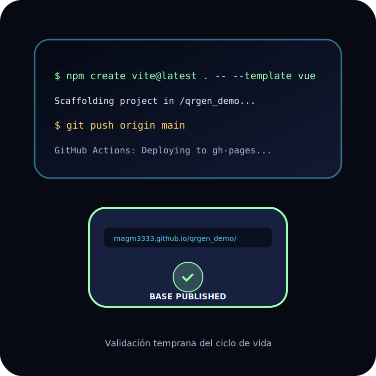

<!-- _class: lead -->


<div class="kicker">Demo practica</div>

# OpenCode + Plannotator

## Del plan al deploy con QRGen

---

## Objetivo

Mostrar un flujo completo y repetible:

- Idea inicial.
- Planificacion por fases.
- Implementacion incremental.
- Refinamiento visual.
- Documentacion y despliegue.

---

## QRGen En Una Frase

QRGen es una app estatica **Vue 3 + Vite** para generar codigos QR y componerlos visualmente sobre una plantilla.


---

## La Presentacion Tambien Es Un Proyecto


- Repo local: `/home/mariano/Documentos/proyectos/presentacion-opencode`.
- Fuente final: `slides.md`.
- Plan editable: `slides-plan.md`.
- Publicacion: GitHub Pages.

---

## Slides Como Plan

Cada slide se trata como una unidad planificable:

| Campo | Uso |
|---|---|
| Estado | idea, borrador, anotada, revisada, final |
| Objetivo | Que debe lograr la slide |
| Anotaciones | Correcciones del usuario |
| Accion final | Como se transforma en `slides.md` |

---

## OpenCode En Esta Demo


OpenCode trabaja dentro del repositorio y ayuda a:

- Leer contexto y restricciones.
- Proponer planes de trabajo.
- Implementar cambios por fase.
- Ejecutar verificaciones.
- Documentar y resumir decisiones.

---

## Instalacion Y Ejecucion De OpenCode

El bloque practico avanza desde CLI basica hasta TUI:

- Instalacion.
- Verificacion, ayuda y version.
- Autenticacion y modelos.
- Inicializacion de proyecto.
- Sesiones, plugins y TUI.

---

## OpenCode: Instalacion

Opcion recomendada por script oficial:

```bash
curl -fsSL https://opencode.ai/install | bash
```

Alternativas:

```bash
npm install -g opencode-ai
brew install anomalyco/tap/opencode
```

---

## OpenCode: Autenticacion Y Modelos


Desde CLI:

```bash
opencode auth login
opencode auth list
opencode models --refresh
```

Desde la TUI:

```text
/connect
/models
```

No mostrar claves ni tokens durante la demo.

🔒 Seguridad: credenciales fuera de slides, scripts y commits.

---

## OpenCode: Inicializar Un Proyecto

```bash
cd /ruta/del/proyecto
opencode
```

Dentro de la TUI:

```text
/init
```

Esto analiza el proyecto y puede crear `AGENTS.md` con reglas y contexto para futuras sesiones.

---

## OpenCode: Plugins y Plannotator


Habilitando herramientas avanzadas:

1. **Instalar:** Traer Plannotator al entorno.
2. **Inicializar:** `/init` en el proyecto nuevo.
3. **Registrar:** Configurar `.opencode/opencode.json`.

> **Plannotator** se activa al registrarlo como plugin del proyecto.

---

## OpenCode + Plannotator: Primer Uso


Meta-demo sobre el repo de esta presentacion:

1. Abrir **PLAN** (`slides-plan.md`) en Plannotator.
2. Anotar una mejora o correccion.
3. OpenCode aplica el cambio al **PRODUCTO** (`slides.md`).
4. Validar con `npm run build`.

---

## Dos Contextos, Una Misma Dinamica


| Contexto | **PLAN** (Guía) | **PRODUCTO** (Resultado) |
|---|---|---|
| Presentacion | `slides-plan.md` | `slides.md` |
| QRGen | `fases-qrgen.md` | Site / App |

Ahora dejamos la meta-demo y pasamos al repo nuevo **QRGen**.

---

## OpenCode: TUI Basica


```bash
opencode /home/mariano/Documentos/proyectos/qrgen_demo
```

Dentro de la TUI:

```text
@src/App.vue     archivo del workspace
@explore         subagente de exploracion
!npm run build   comando shell
/help            ayuda
/sessions        retomar sesiones
/rename          nombrar la sesion
/undo            deshacer ultimo cambio
```

---

## Tipos De Uso / UI


No todo se cambia con la misma tecla:

<div class="grid">
<div class="card">

### Interfaces
CLI, TUI, Web/Attach, IDE.

</div>
<div class="card">

### Intenciones
Planificar, implementar, verificar, documentar.

</div>
<div class="card">

### Modo TUI
Plan / Build con `Tab`.

</div>
<div class="card">

### QRGen
La TUI sera el modo principal de trabajo.

</div>
</div>

---

## Primer Prompt QRGen


Lanzando el proyecto:

```text
Actúa como Ingeniero Senior (Vue 3).
Path: /home/mariano/Documentos/proyectos/qrgen_demo
Repo: magm3333/qrgen_demo. Usa Vue 3 + Vite.
Objetivo: Generador de QR estático en GitHub Pages.
Funcionalidad: Pedir texto, generar QR y descargar
como JPG/PNG. Generá el plan en `fases-qrgen.md`.
No implementes todavía.
```

---

## Plannotator en QRGen


Orquestando la construccion de la App:

- **PLAN:** Cargamos `fases-qrgen.md` en Plannotator.
- **Control:** Asegurar que estamos en **Modo Plan**.
- **PRODUCTO:** OpenCode construye el **Site / App**.
- **Accion:** Revisar, anotar y recien ahi implementar.

---

## Metodo De Demo: QRGen


Una fase = un resultado visible

- **Fase 1:** Estructura base y Auto-deploy.
- **Fase 2:** Logica de generacion QR (MVP).
- **Fase 3:** Descarga y formatos (JPG/PNG).
- **Fase 4:** Interfaz de usuario y UX.
- **Fase 5:** Despliegue final y verificacion.

---

## Fase 1: Estructura Base y Deploy



Asegurando el ciclo de entrega:

1. **Bootstrap:** `npm create vite@latest . -- --template vue`
2. **Base URL:** `vite.config.js` -> `base: '/qrgen_demo/'`
3. **Deploy:** Configurar GitHub Action para `gh-pages`.

---

## Fase 2: Generador QR Minimo

- Instalar libreria `qrcode`.
- Crear `QRGenerator.vue`.
- Input para texto o URL.
- Render en canvas.
- Descargar QR.

---

## Fase 3: Login Estatico SHA256

- Archivo `passwords` con `usuario:hashSHA256`.
- `src/auth.js`.
- Hash con `crypto.subtle.digest`.
- Sesion en `localStorage`.
- Logout explicito.

---

## Fase 4: Editor Visual Basico

- Crear `TemplateEditor.vue`.
- Cargar imagen local como fondo.
- Superponer QR.
- Mover QR con mouse.
- Ajustar posicion, escala y rotacion con controles.

---

## Fase 5: Interaccion Profesional

- Borde de seleccion.
- Handles de escala.
- Handle de rotacion.
- Cursores adecuados.
- Separar mover, escalar y rotar.

---

## Fase 6: Proyectos Y Exportacion

```json
{
  "backgroundImage": "data-url-o-null",
  "canvasWidth": 800,
  "canvasHeight": 600,
  "qrPosition": { "x": 200, "y": 150 },
  "qrScale": 1,
  "qrRotation": 0
}
```

---

## Mapa De Archivos QRGen

| Archivo | Rol |
|---|---|
| `src/App.vue` | Orquestacion general y login |
| `src/auth.js` | Validacion estatica SHA256 |
| `QRGenerator.vue` | Generacion/exportacion QR |
| `TemplateEditor.vue` | Editor visual y exportacion final |
| `passwords` | Usuarios y hashes |
| `deploy.sh` | Publicacion reproducible |

---

## Cierre

- OpenCode acelera la ejecucion cuando el objetivo esta claro.
- Plannotator ordena fases, decisiones y entregables.
- QRGen demuestra el ciclo completo de una app real.
- Markdown + GitHub Pages vuelve la presentacion versionable y publica.

**Siguiente paso:** corregir `slides-plan.md`, enriquecer con capturas y publicar.
