<!-- _class: lead -->
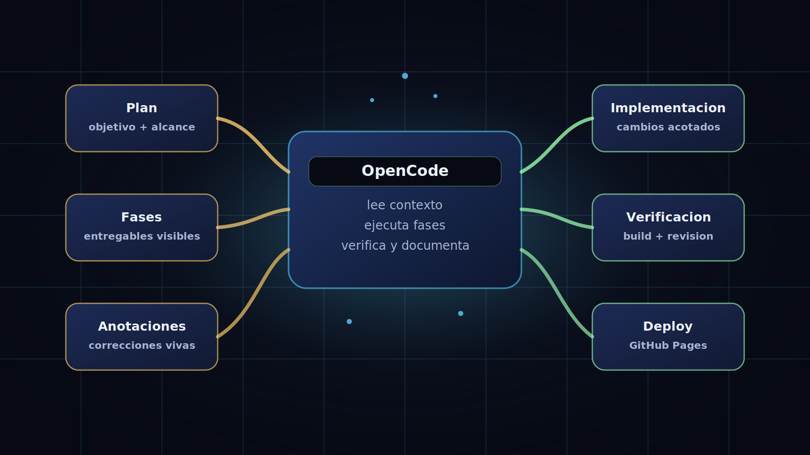

<div class="kicker">Demo practica</div>

# OpenCode + Plannotator

## Del plan al deploy con QRGen

---

## Objetivo

Mostrar un flujo completo y repetible:

- Idea inicial y decisiones técnicas.
- Planificación por fases en Markdown.
- Implementación incremental asistida.
- Refinamiento visual y UX.
- Documentación y despliegue automático.

---

## QRGen En Una Frase

QRGen es una app estatica **Vue 3 + Vite** para generar codigos QR y componerlos visualmente sobre una plantilla.

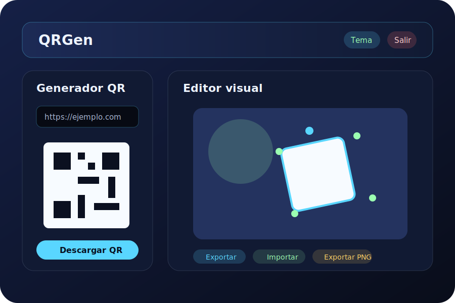

---

## La Presentacion Tambien Es Un Proyecto

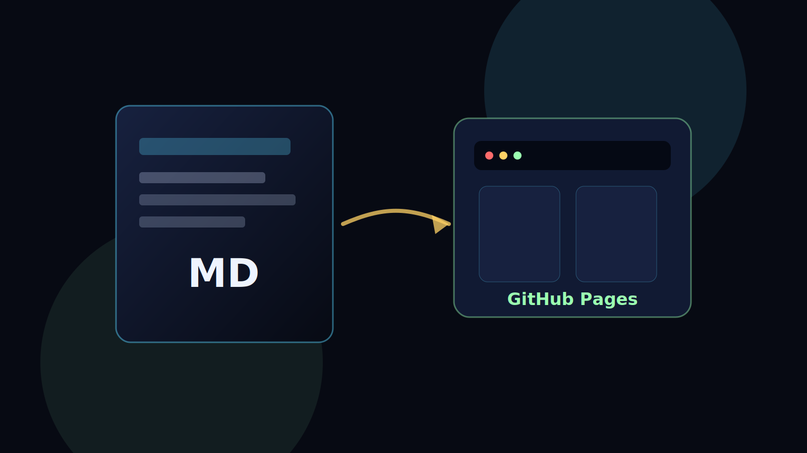

- Repo local: `/home/mariano/Documentos/proyectos/presentacion-opencode`.
- Fuente final: `slides.md`.
- Plan editable: `slides-plan.md`.
- Publicacion: GitHub Pages.

---

## Slides Como Plan

Cada slide se trata como una unidad planificable:

| Campo | Uso |
|---|---|
| Estado | idea, borrador, anotada, revisada, final |
| Objetivo | Que debe lograr la slide |
| Anotaciones | Correcciones del usuario |
| Accion final | Como se transforma en `slides.md` |

---

## Desglose: Estado

La primera fila indica en que punto esta cada slide:

| Estado | Implica |
|---|---|
| `idea` | Existe la intencion, todavia no se desarrollo |
| `borrador` | Tiene contenido inicial para revisar |
| `anotada` | Tiene comentarios pendientes de aplicar |
| `revisada` | Ya incorpora correcciones |
| `final` | Lista para pasar a `slides.md` |

---

## Desglose: Objetivo

El objetivo define el criterio de aceptacion de la slide.

- Que debe entender el publico.
- Que mensaje no debe perderse.
- Que contenido queda fuera para no saturar.

---

## Desglose: Anotaciones

Las anotaciones capturan correcciones sin romper el flujo.

- Quedan asociadas a una slide concreta.
- Evitan perder decisiones durante la iteracion.
- Alimentan la siguiente version de `slides.md`.

---

## Desglose: Accion Final

La accion final traduce la correccion en cambio concreto.

- Indica como debe quedar la slide.
- Sirve de puente entre `slides-plan.md` y `slides.md`.
- Permite regenerar la presentacion de forma controlada.

---

## OpenCode En Esta Demo

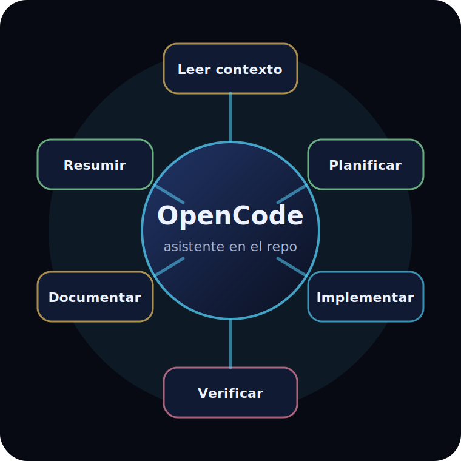

OpenCode trabaja dentro del repositorio y ayuda a:

- Leer contexto y restricciones.
- Proponer planes de trabajo.
- Implementar cambios por fase.
- Ejecutar verificaciones (builds, tests).
- Documentar y resumir decisiones.

---

## Instalacion Y Ejecucion De OpenCode

El bloque practico avanza desde CLI basica hasta TUI:

- Instalacion y Verificación.
- Autenticacion y modelos.
- Inicializacion de proyecto.
- Sesiones, plugins y TUI interactiva.

---

## OpenCode: Instalacion

Opcion recomendada por script oficial:

```bash
curl -fsSL https://opencode.ai/install | bash
```

Alternativas:

```bash
npm install -g opencode-ai
brew install anomalyco/tap/opencode
```

---

## OpenCode: Verificacion Y Ayuda

```bash
opencode --version
opencode --help
```

Primeras comprobaciones utiles:

```bash
opencode auth list
opencode models
```

---

## OpenCode: Autenticacion Y Modelos

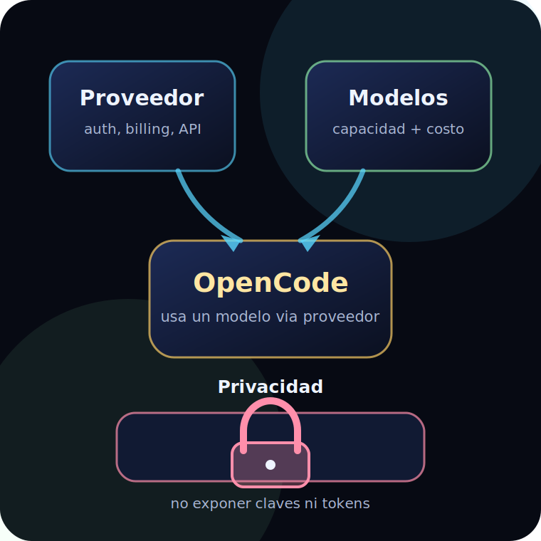

Desde CLI:

```bash
opencode auth login
opencode auth list
opencode models --refresh
```

No mostrar claves ni tokens durante la demo.

🔒 Seguridad: credenciales fuera de slides y commits.

---

## OpenCode: Inicializar Un Proyecto

```bash
cd /ruta/del/proyecto
opencode
```

Dentro de la TUI:

```text
/init
```

Esto analiza el proyecto y puede crear `AGENTS.md` con reglas y contexto para futuras sesiones.

---

## OpenCode: CLI No Interactiva

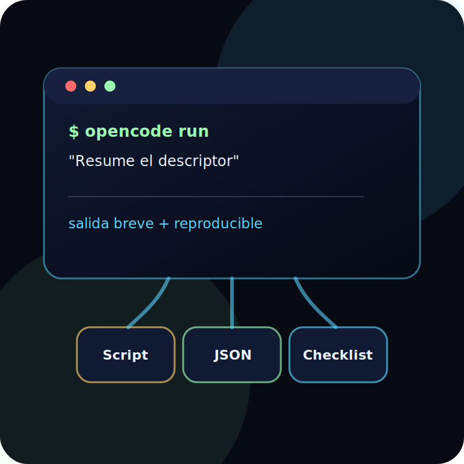

Para consultas rapidas o automatizacion:

```bash
opencode run "Resume el objetivo del proyecto"
```

Con archivos como contexto:

```bash
opencode run --file descriptor-proyecto-qrgen.md \
  "Propone las fases de implementacion"
```

---

## OpenCode: Sesiones Desde CLI

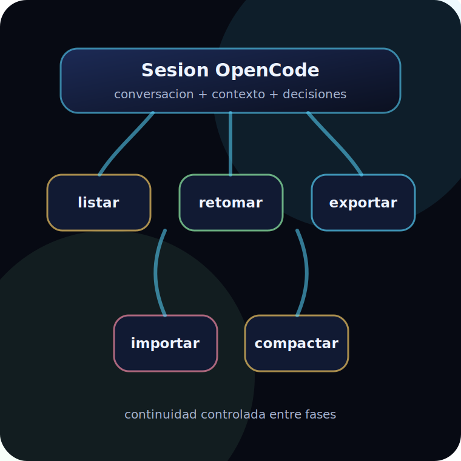

```bash
opencode session list -n 5
opencode --continue
opencode --session <session-id>
```

Exportar historial: `opencode export <id> > session.json`

---

## OpenCode: Plugins y Plannotator

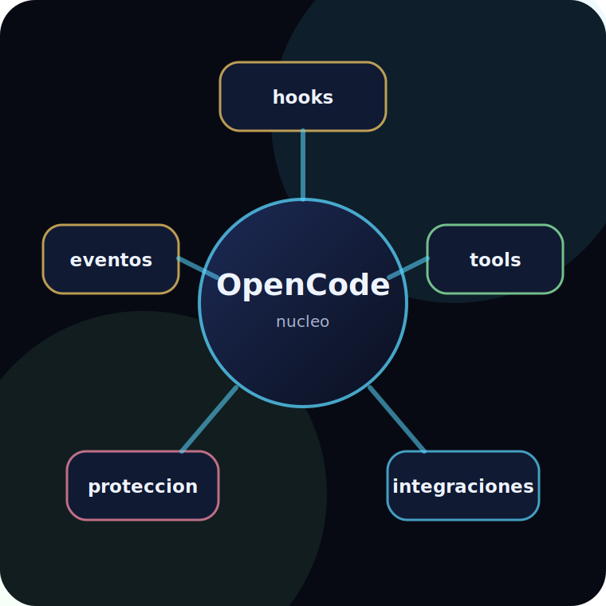

Habilitando herramientas avanzadas:

1. **Instalar:** Plannotator en el sistema.
2. **Inicializar:** `/init` en el proyecto.
3. **Registrar:** Configurar `.opencode/opencode.json`.

> **TIP:** Usar clave `"plugin"` en singular.

---

## OpenCode + Plannotator: Primer Uso

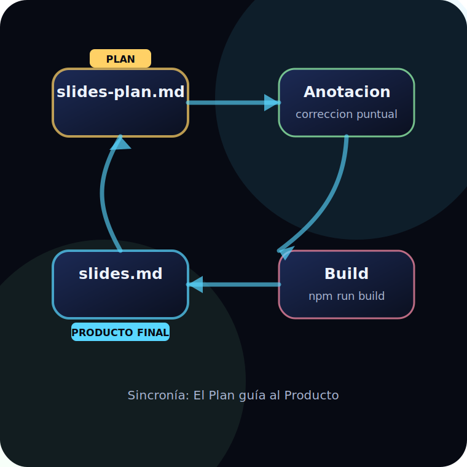

Meta-demo sobre el repo de esta presentacion:

1. Abrir **PLAN** (`slides-plan.md`) en Plannotator.
2. Anotar una mejora o correccion.
3. OpenCode aplica el cambio al **PRODUCTO** (`slides.md`).
4. Validar con `npm run build`.

---

## Dos Contextos, Una Misma Dinamica

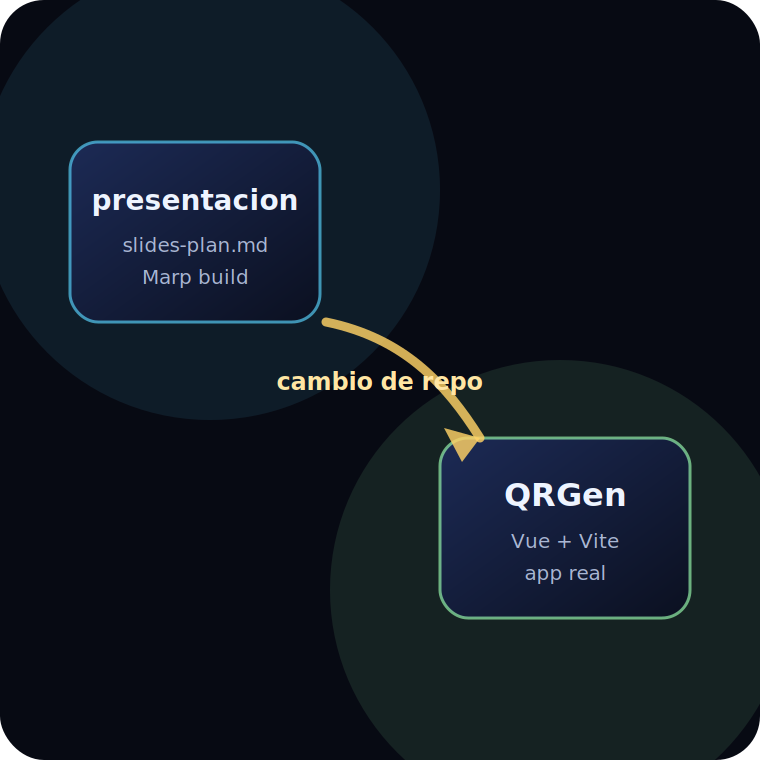

| Contexto | **PLAN** (Guía) | **PRODUCTO** (Resultado) |
|---|---|---|
| Presentacion | `slides-plan.md` | `slides.md` |
| QRGen | `fases-qrgen.md` | Site / App |

Ahora dejamos la meta-demo y pasamos al repo nuevo **QRGen**.

---

## OpenCode: TUI Basica

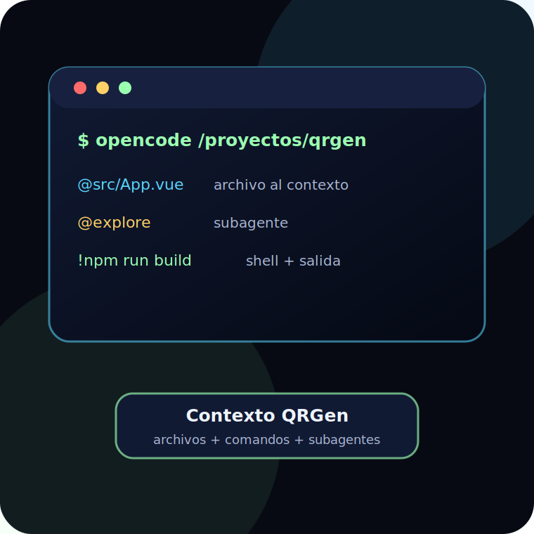

```bash
opencode /home/mariano/Documentos/proyectos/qrgen_demo
```

Dentro de la TUI:

```text
@archivo.vue     contexto de archivos
@explore         subagente de lectura profunda
!npm run build   ejecucion shell
/help            ayuda
/sessions        retomar sesiones
/rename          nombrar la sesion
/undo            deshacer ultimo cambio
```

---

## Tipos De Uso / UI

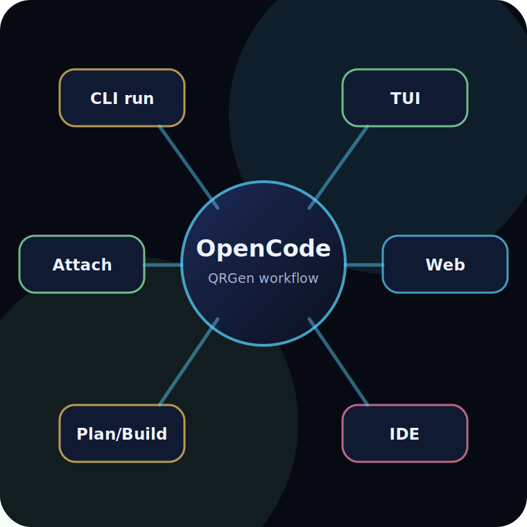

<div class="grid">
<div class="card">

### Interfaces
CLI, TUI, Web, IDE.

</div>
<div class="card">

### Intenciones
Planificar, implementar, verificar.

</div>
<div class="card">

### Modo TUI
Plan / Build con `Tab`.

</div>
<div class="card">

### QRGen
La TUI sera el motor principal.

</div>
</div>

---

## Aclaracion: UI, Uso Y Modo

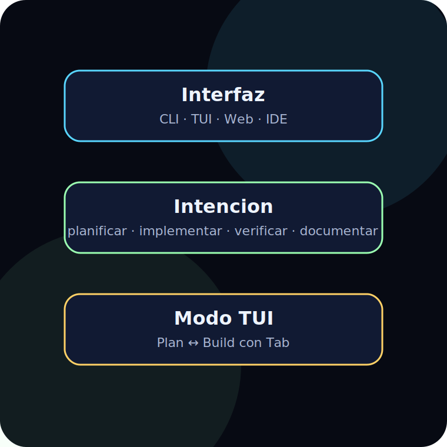

`Tab` cambia **Plan/Build**, no cambia entre CLI/TUI/Web/IDE.

---

## UI: CLI No Interactiva

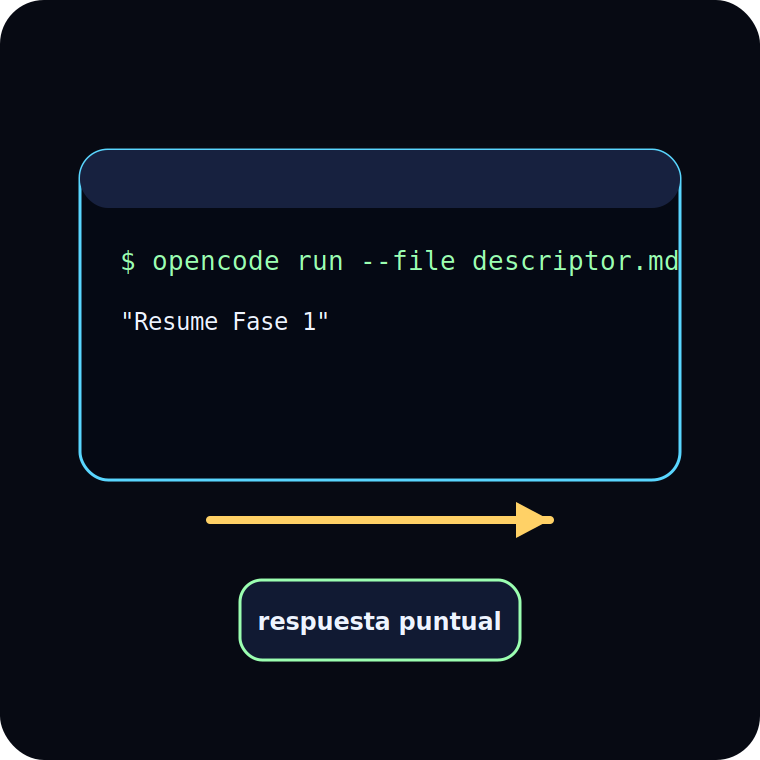

Uso puntual, rapido y scriptable.

```bash
opencode run --file descriptor-proyecto-qrgen.md \
  "Resume la Fase 1 de QRGen"
```

---

## UI: TUI Sobre QRGen

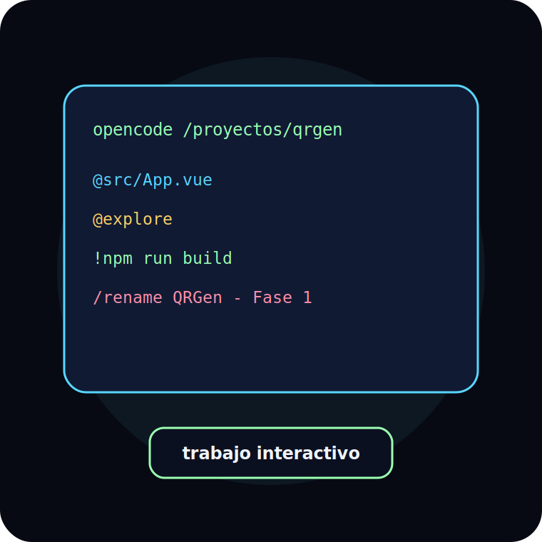

Uso interactivo principal de la demo.

```bash
opencode /home/mariano/Documentos/proyectos/qrgen_demo
```

---

## UI: Web / Attach

```bash
opencode web --port 4096 --hostname 0.0.0.0 --cors "*"
opencode attach http://localhost:4096
```

Sirve para acceso remoto y visualización compartida con CORS habilitado.

---

## UI: IDE

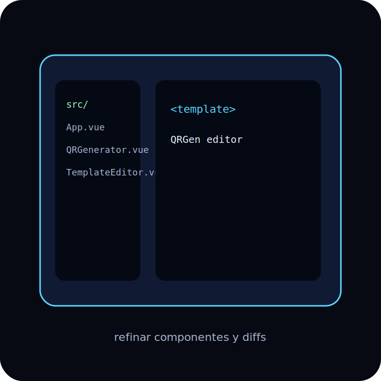

Extensiones integradas (ej. VS Code).

- Foco en archivos abiertos.
- Revision visual de diffs.
- Refinamiento fino de componentes.

---

## Modo Plan / Build

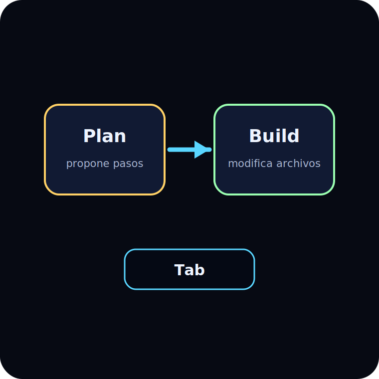

En la TUI, usar `Tab` para alternar cuando esté disponible:

```text
Plan mode  -> propone pasos, no modifica archivos
Build mode -> implementa cambios
```

---

## Primer Prompt QRGen

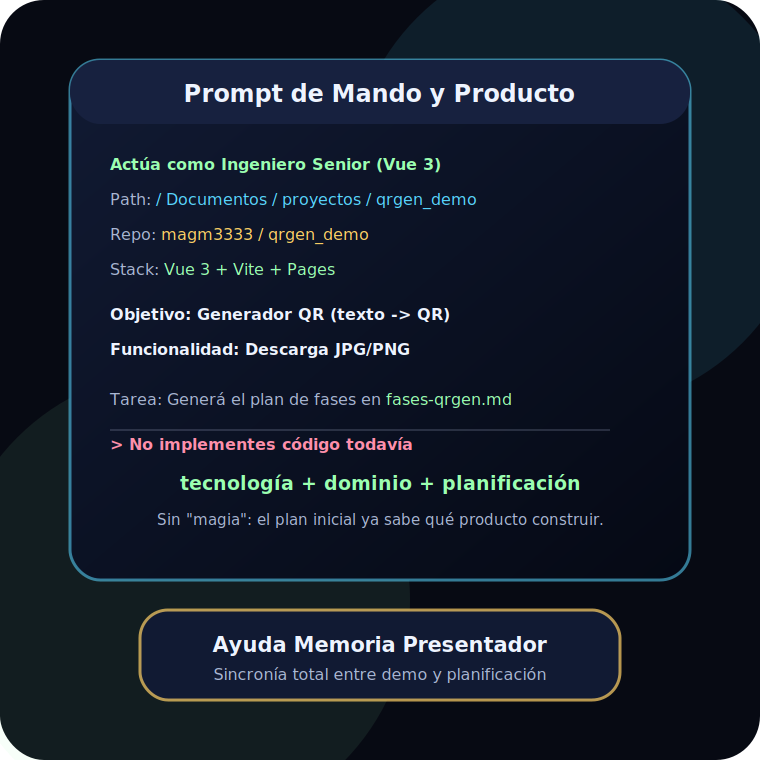

Lanzando el proyecto profesional:

```text
Actúa como Ingeniero Senior (Vue 3).
Path: /home/mariano/Documentos/proyectos/qrgen_demo
Repo: magm3333/qrgen_demo. Usa Vue 3 + Vite.
Objetivo: Generador de QR estático con descargas y plantilla.
Generá el plan en `fases-qrgen.md`.
Al menos estas fases:
1- Estructura + Auto-deploy
2- Generación QR (MVP) "Usa el estilo y layout de magm3333.github.io/qrgen (Split-View de 2 columnas)"
3- Descarga en formatos JPG y PNG Y temas oscuro y claro
4- Editor de planillas que permita subir una imagen y solocar el qr generado automáticamente encima, poder rotarlo, moverlo y cambiarle de tamaño y descargar el resultado en SVG y PNG
5- Login/Logout
6- Ajustes y Agregados finales como exportacion de plantillas, etc
No implementes todavía.
```

---

## Plannotator en QRGen

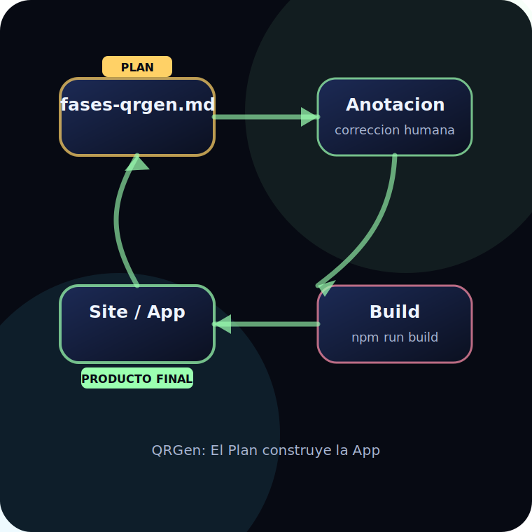

Orquestando la construccion de la App:

- **PLAN:** Cargamos `fases-qrgen.md` en Plannotator.
- **Control:** Asegurar que estamos en **Modo Plan**.
- **PRODUCTO:** OpenCode construye el **Site / App**.

---

## Metodo de Demo: QRGen (Ejemplos)

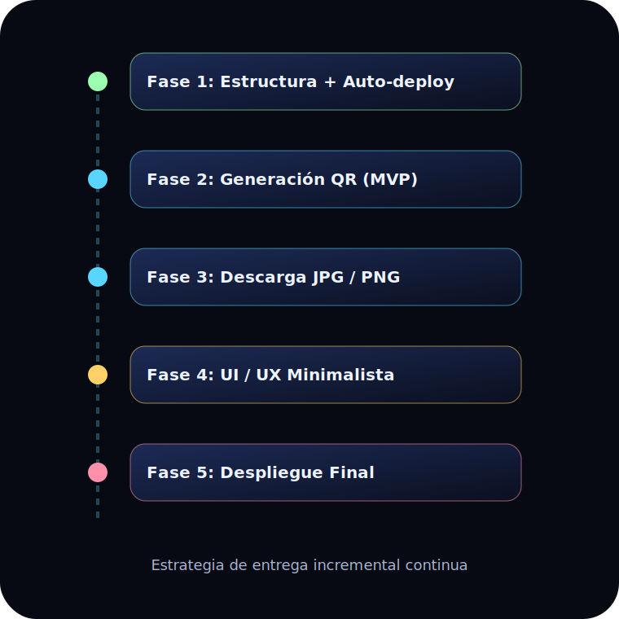

Hoja de ruta sugerida por el asistente:

- **Fase 1:** Estructura base y Auto-deploy.
- **Fase 2:** Generación QR MVP (Split-View).
- **Fase 3:** Descarga JPG/PNG y Temas.
- **Fase 4:** Editor de plantillas interactivo.
- **Fase 5:** Login / Logout estático.
- **Fase 6:** Ajustes y exportación de plantillas.

---

## ¡A Crear!

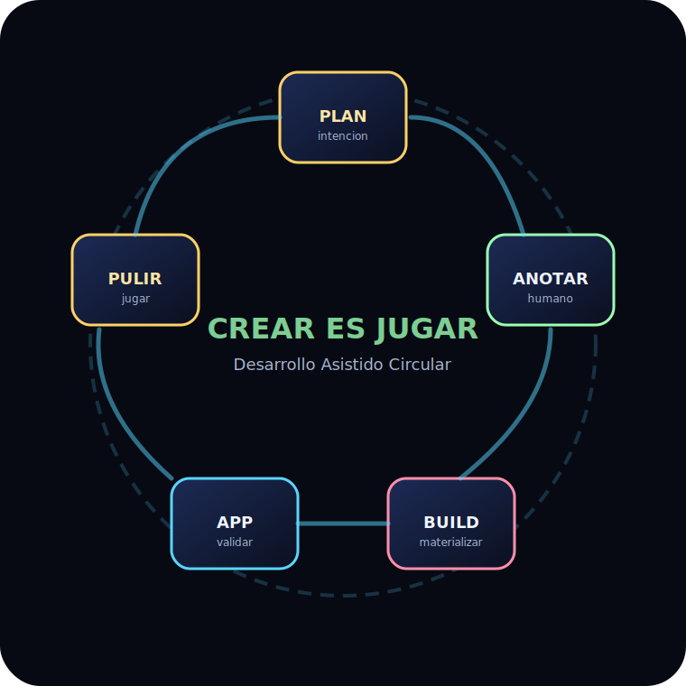

Desarrollo asistido como un juego circular:

1. **PLAN:** Definir intención.
2. **ANOTAR:** Refinar como humanos.
3. **BUILD:** Materializar código.
4. **PRODUCTO:** Validar resultado.
5. **REFINAR:** Volver al plan para pulir.

---

## Cierre

¡Gracias por su atencion!

[magm3333/presentacion-opencode](https://github.com/magm3333/presentacion-opencode)

Desarrollando el futuro, fase por fase.
